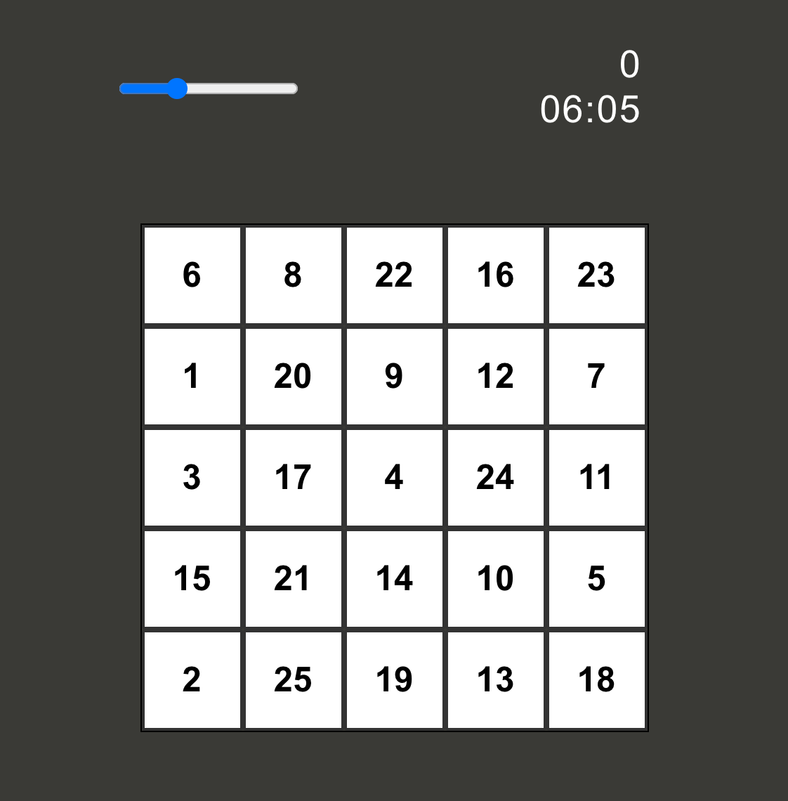
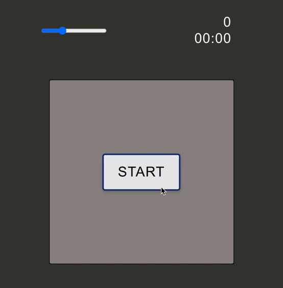
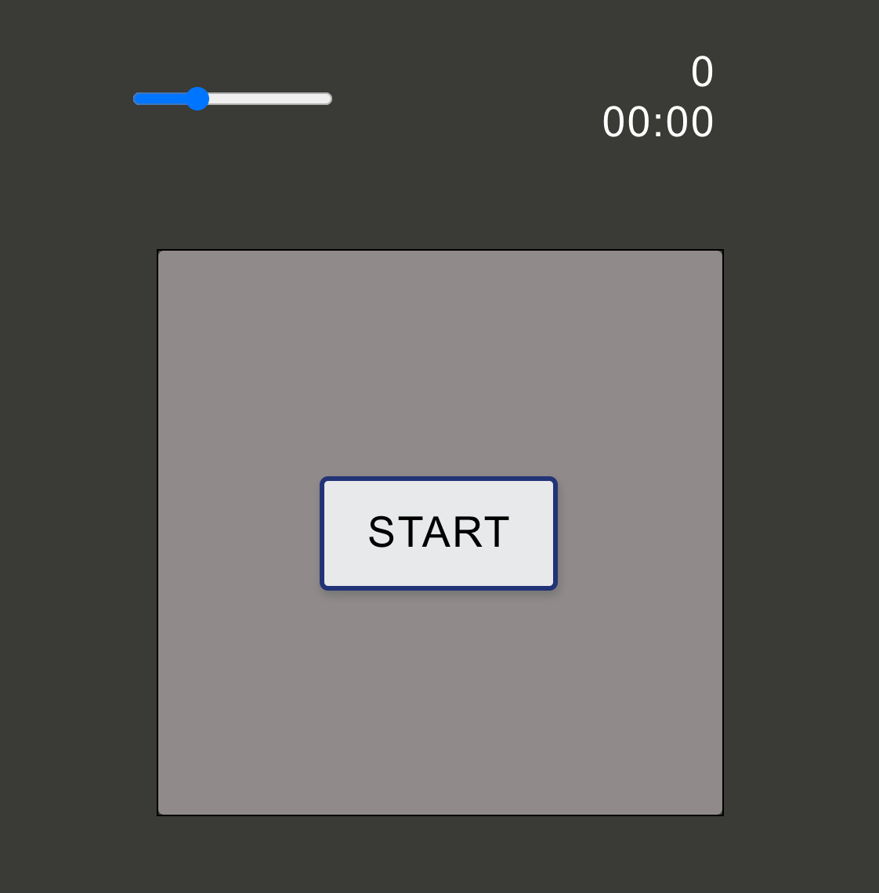
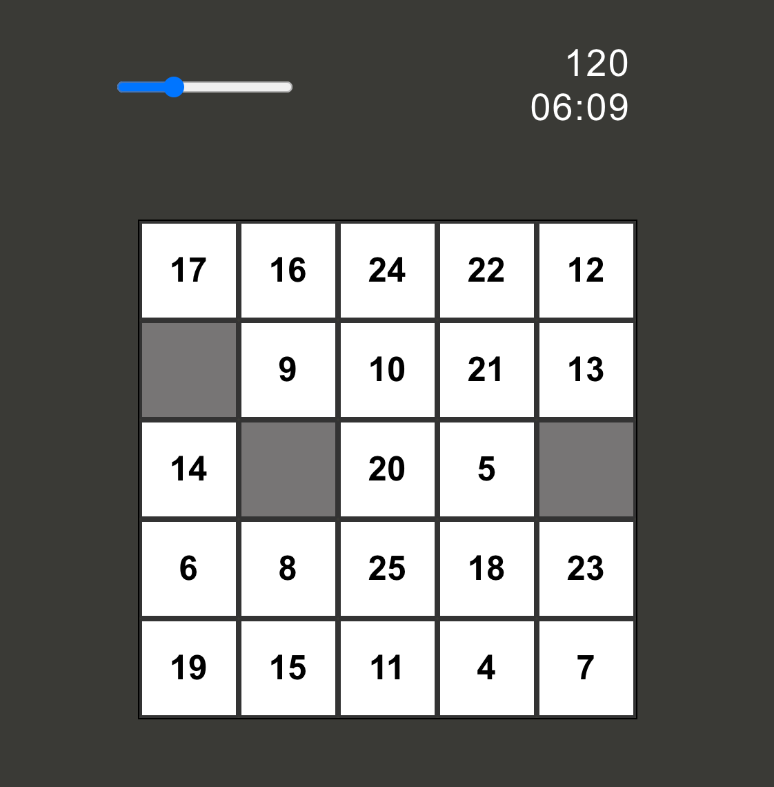
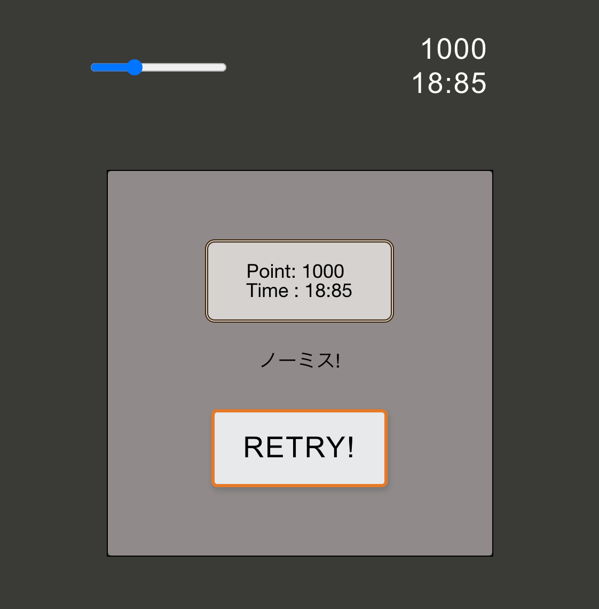

  # CountDown

  ## CountDownとは

1から25までの数字を順番にクリックorタップして消していき、早いタイムを目指すゲームです。<br>

<br>
<br>

<!-- <div align="center">
  
</div> -->
<div align="center">
  

<br>

<br>

  ### サイトURL:<br>
:link: [https://count--down.web.app/](https://count--down.web.app/)

<br>

  ### 制作環境: <br>
:computer: Mac GoogleChrome(ver: 最新) <br>

  ### 動作確認環境: <br>
:computer: Mac GoogleChrome,Safari,Firefox <br>
:iphone: iPhone8 iOS 13 GoogleChrome,safari,firefox
(画面サイズ: iPhone6/7/8~)<br>
<br>
＊スマホでは縦（ポートレート）推奨。
<br>
</div>

<br>

***

<br>

  ## 制作背景

ライブラリを使わないJavaScript、Webpack4を用いたコンパイル、Sassや、FLOCSSを用いた(意識)したCSS等、フロントエンド系の諸技術を使用した習作として制作しました。

<br>

***

<br>


  ## なぜこのゲームを作ろうと思ったか

  ほぼ同じ内容のゲームアプリを、何年も前に好きで良くプレイしていました。<br>
  ある時ふと思い出し、「今ならアレを作る事ができるな。」と思った事ががきっかけでした。<br>

  また、時間経過の概念のある何かを作ってみたいと思っていた、という理由もありました。<br>
<br>
<br>

***
<br>


  ## ゲームの流れ

<br>

  ### 1. &nbsp; スタートボタンを押すと、数字がランダムで配置され、タイムカウンターが動きます

<br>

  ### 2. &nbsp; 数字を順番にクリック (タップ) していきます。

<br>

  ### 3. &nbsp; 最後の数字 (25) を消したら、ゲームクリア！<br>

<br>

  ### 4. &nbsp; タイムを見て一喜一憂する :laughing:

<br>
<br>

<br>

***

<br>


  ## 工夫した点


  ### 表示調整用スライドバー（レンジスライダー）<br>
  まず、これが何かと言うと、ゲームフィールドの表示を調整するためのスライドバーです。<br>

  これは、プレイヤー一人一人が、自分がプレイしやすく微調整できるように用意しました。<br>

  このゲームを作っている時、私はかつてこのゲームにハマっていた頃の事を思い出すことがありました。その中でも妙に思い出されたのは、自分と同じくハマっていた友人や家族が本気でいいタイムを出そうと、それぞれスマホの持ち方を自分が一番操作しやすいようにアレンジしていたことでした。<br>
  その光景を思い出すうち、次第にこう考えるようになりました。我々はゲーム画面に対して身体の方を合わせにいっていたのだな、と。<br>
  <br>
  そう気付いたことで、「今度は自分が作る側なのだから、ゲームが人に合わせられるように工夫しよう」と考えるようになり、結果として微調節用のスライダーを用意しました。<br>
  <br>
  <br>
  また、このスライドバーは、端末がスマホ・PCの場合で役割が変わります。<br>

  - PCで遊ぶ場合<br>
  ゲームフィールド及び、上部の得点と時間のカウンターが拡大・縮小されます。(なおこの際、カウンター部の文字とゲームフィールドでは伸縮の幅を変えて設定してありますので、文字が小さくなり過ぎることはありません。)<br>

- スマホ（縦）で遊ぶ場合<br>
  ゲームフィールドの大きさは変わらず、画面全体に対するゲームフィールドの上下位置を微調整する事ができます。<br>

    これは、スマホの場合、拡大率よりも、操作しやすいエリアの調整ができた方が嬉しいのではないかと考えたためです。<br>

    なぜそう考えたかと言えば、個体差がより大きく出るのは指の腹よりも手のひらや指の長さ(リーチ)だと考えたためです。<br>
    データを取ったわけではありませんが、巨漢の力士も１歳児も同じようにスマホを操作しているところを見たことはありました。
    <!-- （ただ、一方は腕ごと伸ばして、一方はひどくこじんまりとした動きでそれを行なっていましたが..。）<br> -->
    つまり、スマホで一番指の届きやすいスポットが人それぞれ違うので、調整できるようにしたかったのです。
<br>

以上のように、表示調整用のスライドバーは、~~「アプリが人に優しくなる事で、人に愛されるアプリになって欲しい！」という気持ちで実装しました。~~ 過去の体験から、それぞれの使い易さを実現できるよう実装しました。<br>
<br>

***

<br>

  ### メンテナンス性を高める書き方を意識した<br>
メンテナンスやデバッグ、拡張などをしやすいようにコードを書くよう、自分なりに頭を働かせました。
<br>
<br>
実際のコードをいくつか例に挙げてみます。

```JavaScript:&nbsp;script.js

document.addEventListener('DOMContentLoaded', () => {
  ~~~
  ~~~
  changeState('pre'); // デバッグ用
  endCommentSelect('800'); // デバッグ用
});
```
- changeState() の引数に、 ['pre','play','post']を渡すことにより、表示の切り替えを行う事ができます。<br>
<!-- ここに画像 -->
<div align="center">
    
  <div>左から、 'pre'時の画面、'play'時の画面、'post'時の画面</div>
</div>

&nbsp; &nbsp; &nbsp; ▲ &nbsp; この中央の四角いエリアが切り替わります。<br>


```JavaScript:&nbsp;script.js

let conditionToGameClear = 0; // (25 - num)番の要素をクリックしたらゲームクリア

let Game = { point: 0 };
```
- `conditionToGameClear` <br>
  ゲームの終了条件を操作できます。引数に0〜23の数字を渡すことにより、好きな数でゲームを終える事ができます。<br>

  例）<br>
  ・デバッグしたい： &nbsp;23&nbsp; に設定。<br>
    => １枚消すだけでゲームを終える事ができます。<br>

  ・数字を16個にしたい： &nbsp;9&nbsp; に設定。<br>
    => Pag,Sassを使っているのもあり、数分で使用変更が可能です。
<br>
<br>

- `Game`<br>
  得点の初期値を設定する事ができます。<br>
    => 'pre'画面で出てくるメッセージは正答率に合わせて変化します。例えば、この機能をテストする際にはこのように指定します。

    ```
    conditionToGameClear = 23
    Game = { point:960 } // フルスコア時のシュミレート
    ```

<br>
<br>

***

<br>

  ## 反省点

<br>

  ### そもそも作り直しであること<br>
  実はこのアプリケーションは、以前に一度簡単に作ってみて、その時は動いて満足していたものを、その１ヶ月〜１ヶ月半ほど後、反省を込めて修正したものが現状になります。<br>
  <br>

以下のように改善したいリストを要因に分け、修正を行いました。

  --- 前回気になっていたところ ---
<br>

1. 単純に整理されていない事が原因の部分

  - コードの可読性が低いこと
  - 無駄な記述が多いこと


2. 学びを進めた為、気付けた点

  - CSSが雑だったこと
  - メンテナンス性を意識できていなかったこと
  - その時必要ない処理が大量に読まれていたこと
  - 整理されたコードの設計をする工夫が足りないこと

3. そもそも当時やっていなかったこと
  - レスポンシブ対応
  - Pugで書き直す
<br>

2はほぼ1に含まれると考え、コード全体を見直し、考え方・書き方共に整理しながら修正を進めました。<br>

（その結果としては、”工夫した点”に例を挙げてまとめましたので、そちらをご覧いただければと思います。）

<br>

(この辺りの詳細については長くなりそうなので、また近日中に加筆したいと思います)

<br>


  ### 表示調整の動作・記述<br>
  リサイズ時、再読み込み時の画面調整が、一旦動くだけという状態になってしまっているので、こちら修正する予定です。<br>

  実装が現状JSの条件式で行われているため、動作の滑らかさとレスポンスの速さ、コードの効率性などの面で良くない状態です。<br>

  新しいロジックと、適切な処理の間引きなどを含めた修正を、近く行う予定です。

<br>

***

<br>

### 今後改善したい箇所

- 反省点でも挙げた画面の表示調整のJSの記述は修正する予定です。<br>
  思うような動きをしつつ、効率的な記述をできるように、新しいロジックと処理の間引きを加えるつもりです。

- タイムの記録を残せるようにすること<br>
  => 良いタイムを目指すための装置を用意したいと思っています。候補としては主に以下の2案です<br>
  1. Firebaseに接続するなどして他ユーザーを含めたランキング形式にし、タイム・名前などを登録できるようにする。
  2. 個人で楽しむことにより焦点を当て、今日の最高記録や正答率などの情報を出す。
<br>
- 配色・デザインをもう少し改善したい
- ゲームフィールド内、5*5の数字の部分のPugをループ処理で書き換える。<br>
<br>

***

<br>
<br>
:copyright: MasatoYamada

